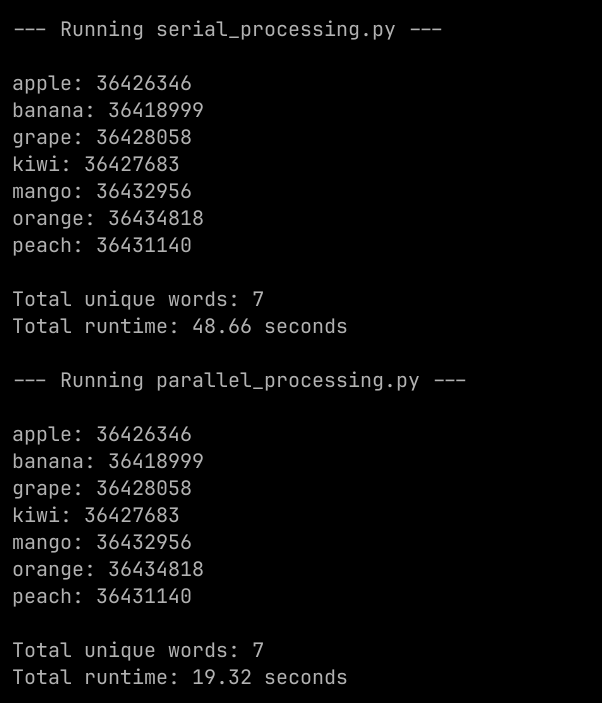

# Word Count Parallelization Project

## Overview

In this project, I explored how to perform word count across multiple large text files using two approaches:

1. **Serial Processing**: Processing files one by one in a single process.
2. **Parallel Processing (MapReduce style)**: Processing files concurrently using multiple CPU cores.

My goal was to compare the performance and results of both methods on the same dataset.

#### Result:


- Serial Run: approx. 48 secons
- Parallel Run: approx. 19 seconds

---

## Files

- `serial_processing.py`  
  Counts the total occurrences of each word across all files **one file at a time**, sequentially.

- `parallel_processing.py`  
  Counts the total occurrences of each word using **parallel processing**. Each file is processed concurrently in separate worker processes, and the results are combined (reduced).

- `compare_speed.py`  
  Runs both `serial_processing.py` and `parallel_processing.py` in sequence, printing the name of each script before execution. Each script outputs its own word counts and runtime metrics.

- `generate_files.py`
  Generates files with 170000 words each. approx. 100MB each

- `data/`  
  Directory containing the input text files (`01_words.txt` to `15_words.txt`), each about 100MB in size.

---

## How to Run

```bash
python generate_files.py
python compare_speed.py
```

This will
- Execute serial_processing.py first, printing word counts and runtime.
- Execute parallel_processing.py next, printing word counts and runtime.
- Allow me to easily compare the speed and output between serial and parallel methods.

#### MapReduce Concept in brief:
MapReduce is a programming model designed to process large datasets efficiently by distributing the work:
- **Map Phase**: The dataset is divided into chunks, and a map function processes each chunk independently (in parallel). For example, counting words in each file separately.
- **Reduce Phase**: The intermediate results from all map tasks are combined by a reduce function to produce the final output. For example, summing counts of the same words from all files.

This model simplifies parallel processing by handling distribution, fault tolerance, and result aggregation, enabling scalable computation over big data.

Paper: [MapReduce: Simplified Data Processing on Large Clusters](https://web.mit.edu/6.1800/www/papers/mapreduce-osdi04.pdf)
